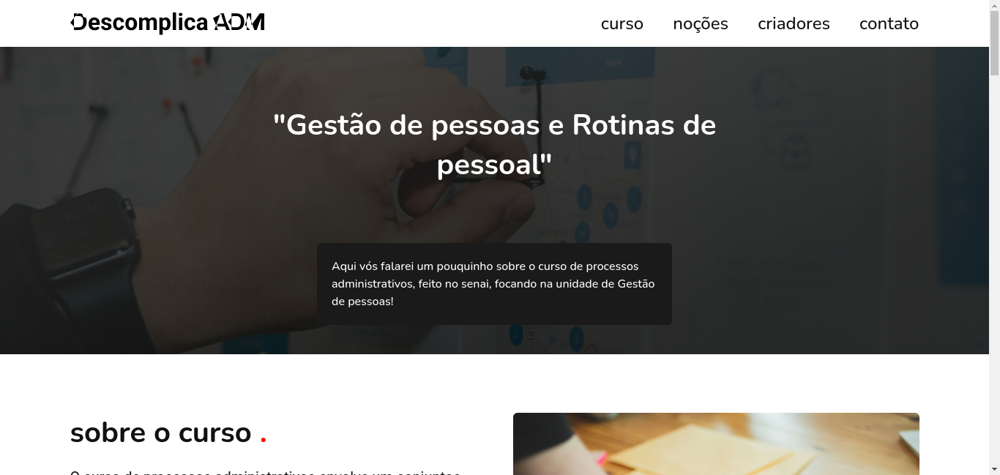

<h1 align="center"> Descomplica ADM </h1>

Uma simples página que me orgulho de ter feito em 2 dias, do design ao código..

## Tecnologias

Esse projeto foi desenvolvido com as seguintes tecnologias:

- HTML & CSS
- Git e GitHub

## Projeto

 Um projeto de blog feito para um trabalho do senai, em que envolvia criar um blog sobre uma unidade curricular do curso. A instrutora nos aconselhou utilizar IA para a criação, porém preferi me desafiar a criar na mão ( também porque sou raiz 😎) e fazer do meu jeito. Ficou simples, parece mais um site do que um blog, mas foi sucesso!

---

Feito com ♥ by Atila Silva :wave: [Caso tenha interesse, meu insta👉🏼](https://www.instagram.com/athilasils/)